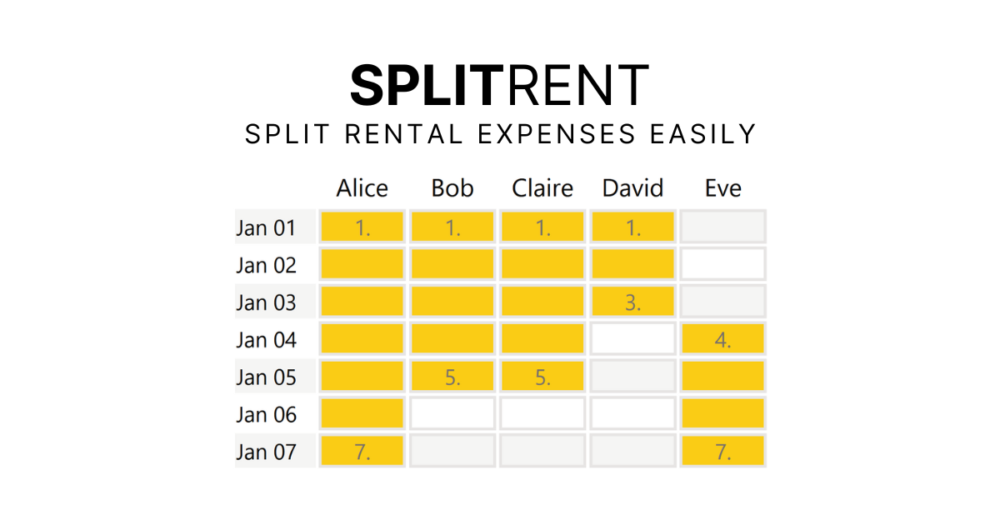

# Split Rent

A simple web app for calculating fair rent splits when multiple people share accommodation, cars etc. for different periods.

## Features

- **Date Range Selection**: Pick start and end dates for the rental period
- **Multi-Tenant Support**: Add/remove tenants and customize names
- **Flexible Occupancy**: Click and drag to select which dates each person is present
- **Smart Calculations**: Two calculation modes:
  - Per calendar night (splits each night's cost among present tenants)
  - Per person-night (divides total cost by total person-nights)
- **Price Breakdown**: Toggle detailed cost breakdown showing nightly rates
- **Shareable**: Generate shareable URLs to send calculations to others

---

Live at [split-rent.niklasluehr.com](https://split-rent.niklasluehr.com).

MIT License  
Inspired by [Splitwise's travel calculator](https://www.splitwise.com/calculators/travel).
